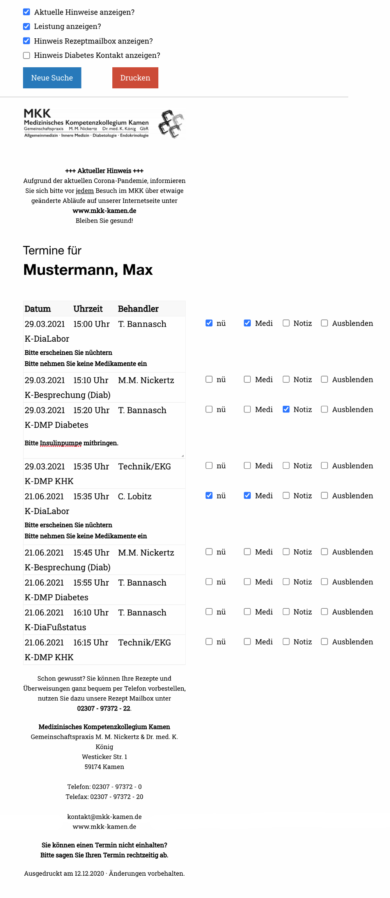

# CGM PRAXISTIMER Terminkartendruck

PHP script which allows printing upcoming appointments managed with CGM PRAXISTIMER on EPSON POS-Printer TM-T20ii.

The latest stable version is: **```1.0.0```**

## Installation

Install nginx with PHP support and install requirements on Debian GNU/Linux:

```sudo apt-get install unixodbc unixodbc-dev
sudo pecl install sqlsrv
sudo pecl install pdo_sqlsrv
```
```
curl https://packages.microsoft.com/keys/microsoft.asc | apt-key add -
curl https://packages.microsoft.com/config/debian/10/prod.list > /etc/apt/sources.list.d/mssql-release.list
sudo apt-get update
sudo ACCEPT_EULA=Y apt-get install msodbcsql17
```
```
# optional: for bcp and sqlcmd
sudo ACCEPT_EULA=Y apt-get install mssql-tools
echo 'export PATH="$PATH:/opt/mssql-tools/bin"' >> ~/.bash_profile
echo 'export PATH="$PATH:/opt/mssql-tools/bin"' >> ~/.bashrc
source ~/.bashrc
```
```
# optional: for unixODBC development headers
sudo apt-get install unixodbc-dev
```
```
# optional: kerberos library for debian-slim distributions
sudo apt-get install libgssapi-krb5-2
```

## Usage



## Dependencies

 - Installed webserver with PHP support (enabled pdo_sqlsrv)
 - Read-access to CGM PRAXISTIMER MS-SQL database
 - [foundation] The most advanced responsive front-end framework in the world.
 - [normalize] A modern, HTML5-ready alternative to CSS resets.
 - [jquery] jQuery is a fast, small, and feature-rich JavaScript library.


## License

MIT

[foundation]: <https://get.foundation>
[normalize]: <https://necolas.github.io/normalize.css>
[jquery]: <https://jquery.com>
